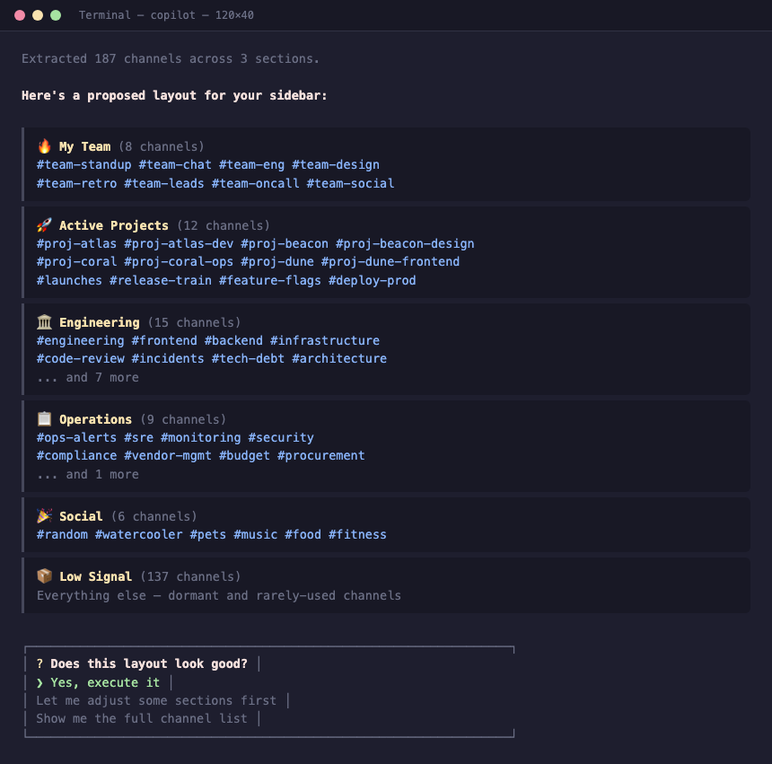

# slack-sidebar-reorg

Automate Slack sidebar organization using Playwright browser automation. Design
a layout, then execute it — channels get sorted into sections with emoji,
automatically.

Built with [GitHub Copilot CLI](https://github.com/features/copilot/cli)
and Claude Opus 4.6. Designed as an AI coding agent skill, but the scripts work standalone too.



> **⚠️ Before you start:**
> - **This takes time.** Execution puppets a real browser, clicking through
>   Slack menus one channel at a time. A sidebar with 200+ channels can take
>   20–30 minutes to fully reorganize.
> - **This is destructive.** Once you approve and execute, your existing sidebar
>   sections are deleted and rebuilt from scratch. You can stop at the design
>   phase (reviewing the proposed layout) without changing anything — but once
>   execution starts, your current sidebar organization will be replaced.

## Install as an Agent Skill

This repo is structured as an agent skill with a `SKILL.md` that teaches the
agent the full workflow. Just tell your agent "organize my Slack sidebar" and
it handles extraction, design, execution, and verification.

### GitHub Copilot (CLI, VS Code, JetBrains)

Clone or symlink into your personal skills directory:

```bash
# Clone
git clone https://github.com/ewilderj/slack-sidebar-reorg.git ~/.github/skills/slack-reorg

# Or symlink from an existing clone
ln -s ~/git/slack-sidebar-reorg ~/.github/skills/slack-reorg
```

Skills in `~/.github/skills/` are auto-discovered by Copilot across all
projects. For per-repo use, place in `.github/skills/` instead.

### Claude Code

```bash
# Global (all projects)
git clone https://github.com/ewilderj/slack-sidebar-reorg.git ~/.claude/skills/slack-reorg

# Or per-project
git clone https://github.com/ewilderj/slack-sidebar-reorg.git .claude/skills/slack-reorg
```

### Gemini CLI

```bash
# Global
git clone https://github.com/ewilderj/slack-sidebar-reorg.git ~/.gemini/skills/slack-reorg

# Or per-project
git clone https://github.com/ewilderj/slack-sidebar-reorg.git .gemini/skills/slack-reorg
```

---

## How it works

1. **Extract** your current sidebar layout (`scripts/extract-sidebar`)
2. **Design** a target layout (YAML config with sections, emoji, and channel assignments)
3. **Diff** current vs. desired to produce an action plan (`scripts/diff-layout`)
4. **Execute** the plan via Playwright (`scripts/execute-reorg`)
5. **Verify** by re-extracting and re-diffing until everything matches

## Requirements

- Python 3.11+
- [uv](https://docs.astral.sh/uv/) (scripts are self-contained with inline dependencies)
- Playwright with Chromium (`uv run --script scripts/login` handles setup)

## Standalone Usage

If you're not using an agent, you can run the scripts directly.

### 1. Login to Slack

```bash
uv run scripts/login --workspace https://mycompany.slack.com
```

This opens a browser for SSO authentication. Your session is saved to
`~/.slack-reorg/sessions/{workspace}/` for reuse.

### 2. Extract current sidebar

```bash
uv run scripts/extract-sidebar --workspace https://mycompany.slack.com > sidebar.json 2>extract.log
```

### 3. Create a layout config

Create a YAML file describing your desired sidebar sections:

```yaml
workspace: https://mycompany.slack.com
sections:
  - name: "🔥 My Team"
    channels:
      - team-chat
      - team-standup
      - team-random
  - name: "🚀 Projects"
    channels:
      - project-alpha
      - project-beta
  - name: "📦 Low Signal"
    channels:
      - general
      - random
      - announcements

# Sections to leave untouched (e.g., DMs, Apps)
keep_sections:
  - Direct messages
  - Apps
```

### 4. Generate an action plan

```bash
uv run scripts/diff-layout --current sidebar.json --desired layout.yaml --pretty
# Save the plan:
uv run scripts/diff-layout --current sidebar.json --desired layout.yaml > action-plan.json
```

### 5. Execute

```bash
# Dry run first
uv run scripts/execute-reorg --plan action-plan.json --workspace https://mycompany.slack.com --dry-run

# Execute for real
uv run scripts/execute-reorg --plan action-plan.json --workspace https://mycompany.slack.com
```

### 6. Verify and retry

The execute script may not move all channels in a single pass.
Always verify:

```bash
# Re-extract
uv run scripts/extract-sidebar --workspace https://mycompany.slack.com > sidebar-after.json 2>extract.log

# Re-diff
uv run scripts/diff-layout --current sidebar-after.json --desired layout.yaml --pretty

# If moves remain, re-run (skipping delete/create since sections exist):
uv run scripts/execute-reorg --plan action-plan.json --workspace https://mycompany.slack.com --skip-phases delete create
```

Repeat until diff shows zero moves.

## Scripts

| Script | Purpose |
|--------|---------|
| `scripts/login` | Authenticate with Slack via browser SSO |
| `scripts/extract-sidebar` | Extract current sidebar layout as JSON |
| `scripts/diff-layout` | Compare current vs. desired layout, output action plan |
| `scripts/execute-reorg` | Execute action plan via Playwright |
| `scripts/session_helper.py` | Shared session/path utilities |

## How the execution works

- **Phase 1 — Delete**: Removes existing custom sections (channels fall to "Channels")
- **Phase 2 — Create**: Creates fresh sections with emoji (in reverse order so top-down matches config)
- **Phase 3 — Move**: Linear scan of the sidebar, moving channels to target sections

The delete-first strategy ensures emoji are always set correctly and avoids
conflicts with existing sections.

## Known limitations

- Slack Connect channels and DMs cannot be moved between sections (automatically skipped)
- Common section names like "Social" trigger Slack's suggestion UI (handled automatically)
- Virtualised sidebar means only ~20 channels are in the DOM at once (scripts scroll to find items)
- ~5 seconds per channel move due to menu interaction timing

## License

MIT — see [LICENSE](LICENSE).
